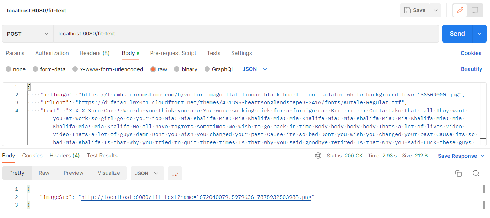
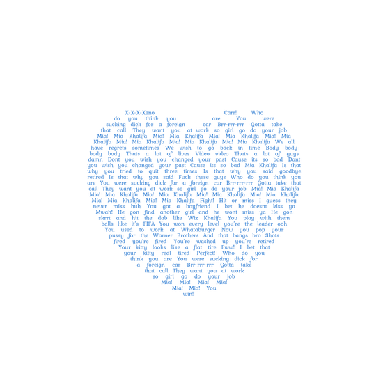

# Fill Text To Shape

A web API built for creating an image with a pre-determined shape. The user will send request to the API with shape URL (colored shape with transparent background), desired text and other parameters. The website will render the image and expose an URL for the rendered image.

## Sample request

    

## Sample shape input

    

## Sample image output

    

